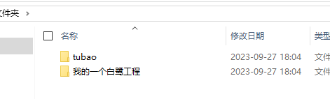
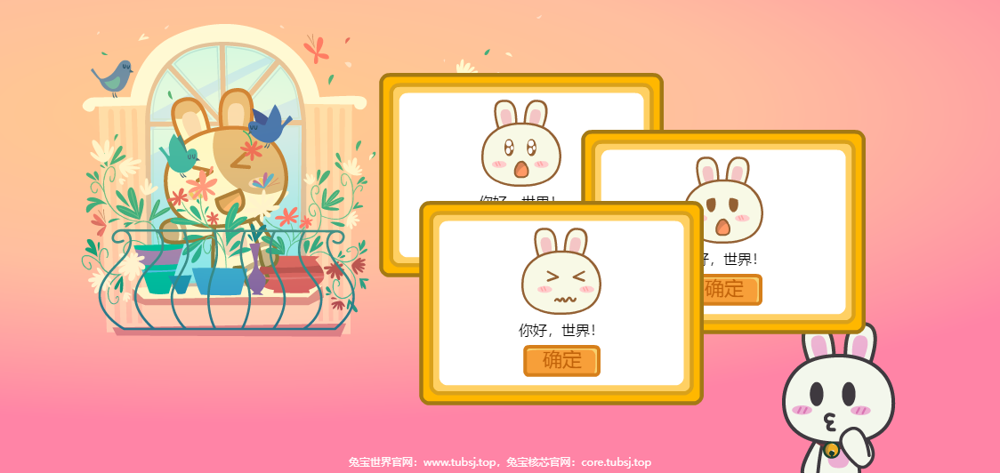
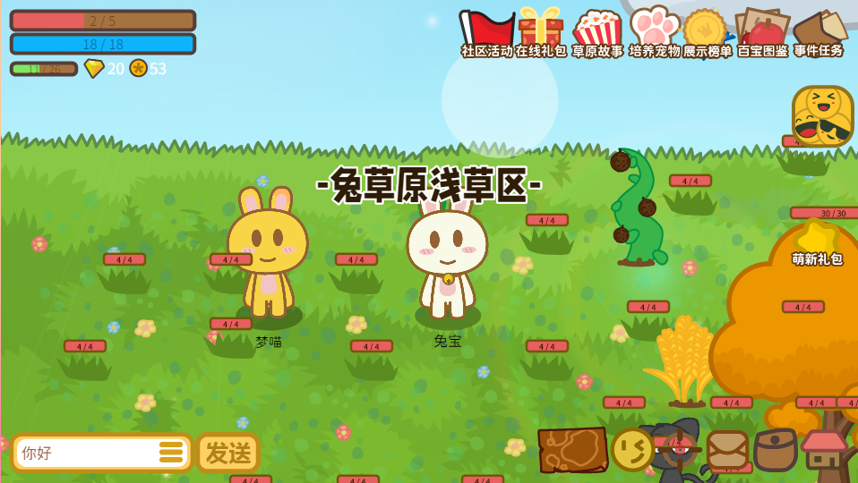

<p align="center">
    
</p>

# 兔宝核芯

​	兔宝核芯是一个游戏及应用研发的整体解决方案，其应用Html5技术栈作为底层实现，而在兔宝核芯里面的一个H5前端实现Tubao.js开放大众免费商用，Tubao.js建立在Egret白鹭引擎上运行，遵循白鹭引擎的一切规则，提供引擎之外的API实现，同时继承Html5和egret白鹭引擎的优良特性，可以让部分游戏研发过程变的更加迅速高效。


## 产品特征与优势

- 多端互通，页游、手游、小游戏、轻游戏，一次开发简单修改全网发布。

- 二维画面，目前我方只支持2D画面的实现，当然如果你愿意扩展三维能力当然也是欢迎的。

- 轻量急速，轻量级理念来设计产品，尽可能保证所有设备都可以稳定运行，低成本极速体验。

- 共建生态，邀请您共同建设兔宝世界文化生态，可以基于本框架实现更多上层实现。

- 高速研发，提供游戏常用基础功能，API直接调用，避免造轮子，助力高速研发，统一架构实现。


# 部署安装框架

首先你需要安装完毕Egret白鹭引擎，并且我建议请使用白鹭引擎的5.3.10，我们框架就是建立在这个版本上进一步开发的。

* 考虑到白鹭引擎现在已经停止服务，建议通过这位大神的白鹭站点首先完成白鹭引擎的安装部署 [网上大神的白鹭引擎支持站](https://egret.pages.dev/) 

* 下载仓库中的全部内容并且放到一个名字叫tubao的文件夹，然后将这个文件夹，放到你的白鹭工程同目录中

* 配置你的白鹭工程中的**egretProperties.json**文件添加配置目录，指向包含bin文件夹内容的工程目录

  ```json
      {
        "name": "tubao",
        "path": "../tubao"
      }
  ```


然后我们就可以方便的使用兔宝框架了。


# 开始

#### TypeScript

Egret 项目使用 TypeScirpt 语言来开发。TypeScript 是 JavaScript 的超集，具体内容可以参考 [TyptScript语言手册](http://bbs.egret.com/thread-1441-1-1.html)。Egret 的 API 和 AS3 有很多相似之处，如果您熟悉的话肯定容易上手。

#### 编写第一行代码

在下载完成的工程实例中，游戏项目的入口类默认在src/Main.ts里面，不过为了方便起见你可以直接在game.ts中添加代码。下面编写我们的项目的第一行代码,在默认的代码中找到addPopup()函数，修改为```new tubao.base.popup(`basics0${tubao.algo.tool.scoueRandom(1, 9)}_png`, "你好，世界！");```,然后就变成了下面的样子：

```typescript
    /**
     * 添加弹窗
     */
    public addPopup() {
        new tubao.base.popup(`basics0${tubao.algo.tool.scoueRandom(1, 9)}_png`, "你好，世界！");
    }
```

我们使用如下命令构建项目：

    egret build

点击屏幕，然后就可以看到运行出来的结果了：



恭喜你完成。

更多内容请参考学习模块查看文档学习。

# 实际产品

目前应用兔宝脚本的实际产品《兔宝世界》轻度休闲养成社区游戏：

在线体验地址请点击：[体验地址](https://www.tubao.cc)<br/>

查看更多示例，请期待兔宝核芯官网：[兔宝核芯官网](https://core.tubao.cc)<br/>

# 学习

* 访问 [使用文档](http://core.tubao.cc/doc.html) 获取框架的使用文档
* 访问 [API](http://core.tubao.cc/api/index.html) 获取 API 使用文档


# 兔宝的功能

* adapter 布局资源解析器
* algo各式各样的算法
* base基础能力
* DB龙骨系统
* list下拉列表
* editor编辑器系统
* effect特效类
* mvc框架基类
* paint画笔
* richTextFiled兔宝富文本
* scene场景系统类
* sound音乐底层支持
* utils工具箱
* video视频系统
* 其他能力


# 交流

一个好的问题是参与开放社区的第一步，你可以先提Issues。

我们鼓励你到兔宝世界玩家交流群（qq群：601157224）中进行提问和回答问题，也能够帮助后来者更高效的解决问题。

# 开放程度与许可证

**关于美术**

官方项目案例中关于兔宝世界文化的素材，其中UI界面个人公司都可以免费商用，但是禁止二次授权，人物形象请联系我方进行商务洽谈。

**关于软件**

Tubao.js免费开放，开发出来的游戏产品可商用。尽管我这边使用BSD许可协议，但是可编译的源代码不开放，有任何问题可以反馈给我，我进行具体情况分析来版本更新，当然你也可以直接在三个生成文件中手动修改，满足自己的一些小型的定制化需求，这个我们是不会介意的。

This content is released under the (https://opensource.org/licenses/BSD-2-Clause) BSD License.


